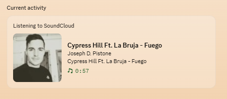

# rpc4SoundCloud

Shows what you're listening to on SoundCloud as a Discord Rich Presence
("Listening to SoundCloud — Track — Artist"), the same way Discord's native
Spotify integration works — except SoundCloud has no such integration, so
we build our own pipeline.

## Images



## Why three pieces?

| Piece | Runs where | Job |
|---|---|---|
| `extension/` | Your browser, on soundcloud.com tabs | Reads `navigator.mediaSession` metadata (title/artist/artwork/playing state) and streams it out over a WebSocket |
| `relay-server/` | A terminal on your machine | A tiny always-on WebSocket server that just re-broadcasts whatever it receives — the only piece that can *accept* connections |
| `vencord-plugin/` | Discord's desktop client (via Vencord) | Connects to the relay, and on every update calls the same internal Discord action (`LOCAL_ACTIVITY_UPDATE`) that the built-in CustomRPC plugin uses |

A browser tab can't listen for incoming connections, and Discord's renderer
(where Vencord plugins live) can't easily either — so the relay server in
the middle is what makes this work. It's the same shape as tools like
WebNowPlaying-RPC.

```
SoundCloud tab → extension (WS client) → relay server (WS server) → Vencord plugin (WS client) → Discord
```

## Setup

### 1. Relay server
```bash
cd relay-server
npm install
npm start
```
Leave this running in a terminal whenever you want the presence to work.

### 2. Browser extension
- Chrome/Edge: go to `chrome://extensions`, enable Developer Mode, "Load unpacked", select the `extension/` folder.
- Firefox: go to `about:debugging#/runtime/this-firefox`, "Load Temporary Add-on", select `extension/manifest.json`.
- Open a SoundCloud tab and start playing something — check the extension's console (page devtools) for `[rpc4SoundCloud] connected to relay`.

### 3. Vencord plugin
- Copy `vencord-plugin/` into your local Vencord source at `src/userplugins/rpc4SoundCloud/` (rename the folder to just `rpc4SoundCloud` if it isn't already).
- Rebuild Vencord (`pnpm build`, or whatever your dev setup uses) and restart Discord.
- Enable "rpc4SoundCloud" under Settings → Vencord → Plugins.
- Optional: create an application at the [Discord Developer Portal](https://discord.com/developers/applications) and paste its ID into the plugin's "App ID" setting — this changes what name/icon shows next to the activity type badge.

Make sure **Settings → Activity Privacy → Display current activity as a status message** is on, or nobody (including you) will see it.

## How the pieces actually work

- **Media Session API instead of DOM scraping**: SoundCloud sets `navigator.mediaSession.metadata` so your OS media keys and lock screen widget know what's playing. Content scripts share the page's DOM and most Web APIs (they just don't share JS variables the page itself declared), so we can read this directly instead of hunting for CSS class names that SoundCloud will eventually rename and break.
- **`LOCAL_ACTIVITY_UPDATE`**: this is the exact Flux action Vencord's own `CustomRPC` plugin dispatches internally to push a Rich Presence — pulled straight from its source. Reusing it means we don't have to reimplement any Discord-side RPC protocol ourselves.
- **Polling, not events**: the Media Session API has no "metadata changed" event, so the content script just polls every second and only sends a message when the payload actually differs from last time.

## Known rough edges / good next steps for learning

- **Reconnect logic** exists on both the extension and the plugin side, but if you close the SoundCloud tab entirely, nothing tells the plugin to clear the presence until its socket errors out — you could send an explicit `beforeunload` message to fix that.
- **Artwork rendering**: confirmed in testing — the artwork slot currently shows a generic placeholder instead of the actual track art. Discord's docs say external image URLs work directly in `assets.large_image`, but presence-hacking tools often need the `mp:external/<url>` prefix trick to get an external image to render properly. PRs welcome if you figure out the right format.
- **Multiple tabs**: if you have two SoundCloud tabs open, they'll both connect and stomp on each other's messages through the relay. Tagging messages with a tab ID and having the plugin pick "most recently active" would be a nice upgrade.
- **Progress bar**: this version only shows elapsed time via `timestamps.start`, not a fixed end time, because SoundCloud doesn't expose track duration through Media Session. You could scrape the visible progress bar's `aria-valuenow`/duration text for that if you want a real "3:12 / 4:05" style bar.

## License

MIT — see [LICENSE](./LICENSE).

## A heads-up

Vencord is a Discord client modification, which is against Discord's Terms
of Service (in practice, Discord doesn't appear to enforce against it), and
running your own Rich Presence hack is the same category of thing tools
like the built-in CustomRPC or LastFMRichPresence plugins already do. Worth
knowing before you rely on this for anything important.